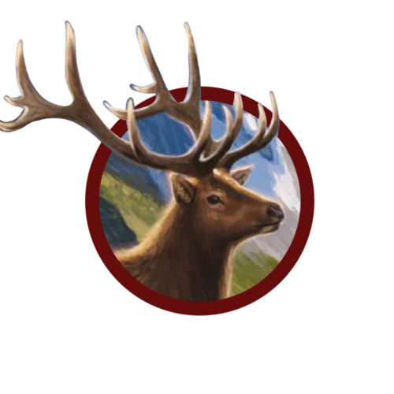

   
  
  <h1>Cascoria</h1>
  

    A score keeping app for the board game Cascadia 🦌🐻🦅🐟🦊
  

<!-- Badges -->

   
   
   

---

This project was created with [Vue.js 3](https://v3.vuejs.org/) and [Vite](https://vitejs.dev/).

---

by [Philipp B.](https://github.com/cophilot)
